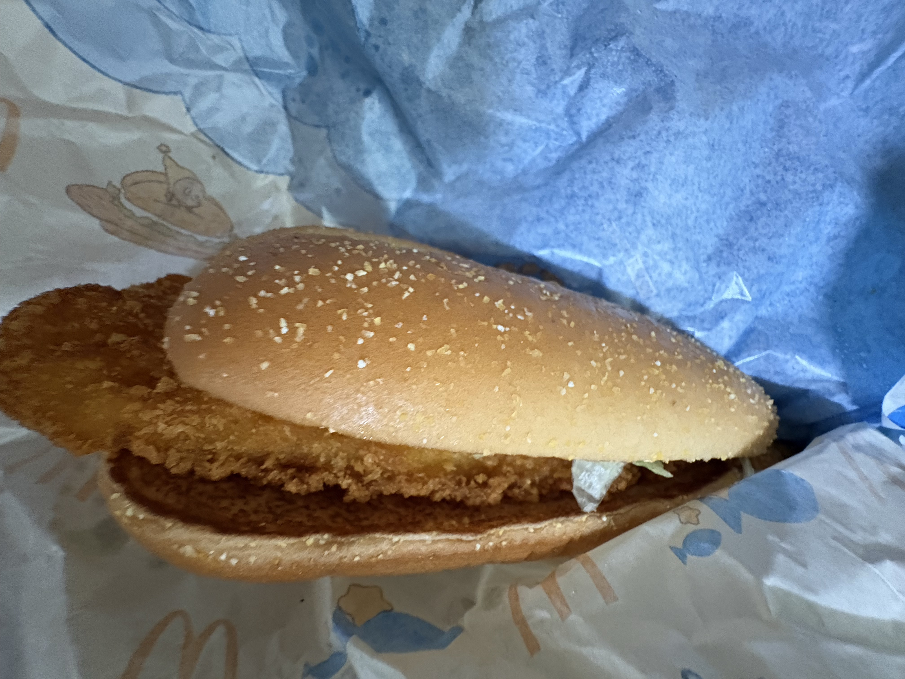

麦当劳这次和星星人（Twinkle Twinkle）的联动为我们带来了全新的几款餐品，联动的特殊餐品包含一款汉堡 **「长长长深海鳕鱼堡」**、全新外形的 **「星愿薯饼」**、新口味的麦旋风 **「星云海盐焦糖风味麦旋风」** 以及饮品 **「咕噜咕噜橘子风味冻冻汽水」**。这些限定新品到底是为我们带来全新的风味，还是单单换个样子圈米呢？ 

> 本文真实测评
> 个人口味观点，欢迎交流

## 基本信息

|餐品名称|上架时间|价格|
| ------------ | ------------ | ------------ |
|长长深海鳕鱼堡|2026-05-20|25|
|星愿薯饼|2026-05-20|9.9|
|星云海盐焦糖风味麦旋风|2026-05-20|16|
|咕噜咕噜橘子风味冻冻汽水|2026-05-20|9.9|
---

## 长长深海鳕鱼堡

首先，让我们来测评一下最令人期待的汉堡新品 **「长长深海鳕鱼堡」**。 
第一次看，感觉就是板烧一个模子刻出来的。买到手一看，确实就是跟板烧一样的配置，只是把板烧鸡扒换成了一条鳕鱼排。 
一样的长汉堡面包，一样的拼装位置，一样的沙拉酱。 
只有内陷不同，其他都是一样的。 
 
我是很喜欢吃双层鳕鱼堡的，但是对于这个长的跟板烧一样的鳕鱼堡，不仅只有薄薄的一层鳕鱼排，而且并没有双层鳕鱼堡带来的汁水香味，只是单纯的干巴巴鱼肉。 
同时，因为单调的酱汁（甚至不是麦香鱼酱），吃到1/3就觉得开始很腻了。 
但是配上一杯可乐的套餐只要19.9。想要尝试一下的还是可以买一份试一下的。 ~~我确信你不会买第二次~~  

| 项目 | 评分（满分5⭐）|
|------|--------------|
| 口感 | ⭐⭐|
| 颜值 | ⭐⭐ |
| 性价比 | ⭐ |
| 回购意愿 | ⭐ |

## 星愿薯饼

再来说一下麦当劳土豆全新外形的 **「星愿薯饼」**。 
麦当劳的土豆无论是薯条还是早餐才有的薯饼，在我这里都是给到一个**夯**的评价。 
我个人认为，星愿薯饼的形状和颜色都比较符合星星人的风格，但是我觉得这个薯饼做的太小一个了，给人的感觉像是一块早上卖剩的薯饼上面扣下来的，性价比比较低吧。 
如果我想吃麦当劳的土豆，我还是会选择 **「薯条四重奏」**。 

| 项目 | 评分（满分5⭐）|
|------|--------------|
| 口感 | ⭐⭐⭐⭐⭐ |
| 颜值 | ⭐⭐⭐⭐⭐ |
| 性价比 | ⭐⭐⭐ |
| 回购意愿 | ⭐⭐ |

## 星云海盐焦糖风味麦旋风

对于麦旋风，我还是只吃奥利奥口味的麦旋风，因为我不太喜欢吃甜食，所有我觉得奥利奥口味的麦旋风已经够甜了，所有我没有购买 **星云海盐焦糖风味麦旋风**进行尝试 

## 咕噜咕噜橘子风味冻冻汽水

首先，一句话总结：橙子味芬达加椰果。 
首先橙子味道的汽水在口味方面做不出什么新花样，而且也没有什么特别的风味。 
至于冻冻，量特别的少，几乎只有头两口能吸到，或许刚入口时橙子汽水配上冻冻确实让人获得一个新奇的口感，但是等冻冻吸完后，就只剩下了一杯食之无味的芬达。 

| 项目 | 评分（满分5⭐）|
|------|--------------|
| 口感 | ⭐⭐⭐ |
| 颜值 | ⭐⭐⭐ |
| 性价比 | ⭐⭐ |
| 回购意愿 | ⭐ |

## 总评

这次麦当劳与星星人的联动餐品我看不出任何的诚意。无论是新餐品还是联动的周边，我感受只有一股圈钱的味道~~（或许是星星人IP授权太贵了）~~。总而言之，这是一次不太成功的联动。希望麦当劳未来的新餐品能够给我们带来全新的惊喜。~~什么时候能返场虾堡？~~

> 我建议你不要购买这四款餐品，而是选择其他更便宜的餐品。
> 你购买了这四款餐品吗？评论区聊聊 👇