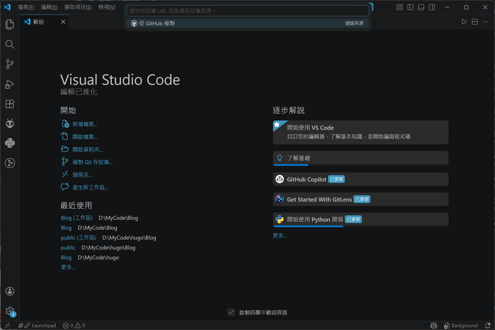
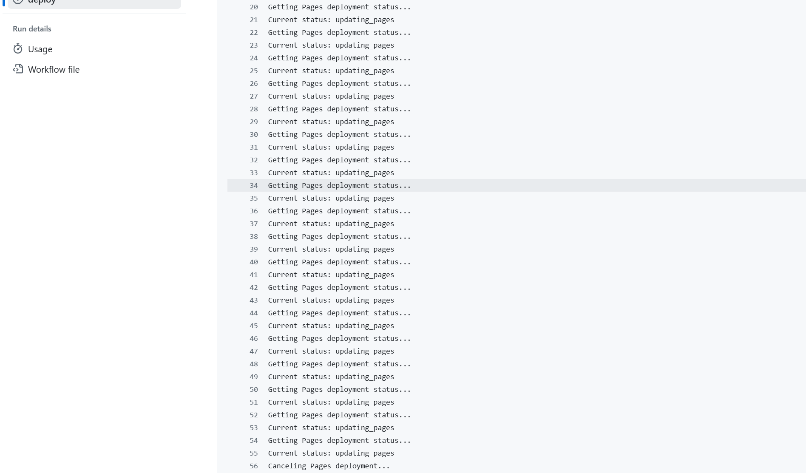

# 使用 Hugo + Stack 主题快速搭建个人博客

> 本文介绍了如果使用Hugo + Stack 主题快速搭建个人博客，再搭配 Github Pages 实现0成本搭建个人博客的全过程。<br>
> 本文下方使用的是 Stack 主题，如果你使用的主题不一致可能会有部分内容无法对上，请查看所使用的主题的文档。

## 开始前准备

在正式开始教程前，请确保你拥有以下的**条件**：

    - 一台电脑
        - 需要安装了 Visual Studio Code（亦或是其他的IDE，本文使用 Visual Studio Code 作为演示）
        - 需要安装了 Git
        - 需要能够正常上网
    - 一个可用的 Github 账号

## 关于Hugo

Hugo 是一个使用了Go语言编写的静态站点生成器。它的框架灵活，并支持分类和多语言系统，因此我认为 Hugo 非常适合用来搭建一些较为简单的个人博客或是静态展示网页。

---

## 第一步：站在巨人的肩膀上出发

### 克隆 Stack 主题的模板仓库

Stack 官方为我们准备了一个快速上手的 Github 模板仓库。通过使用这个模板，我们能够跳过安装 Hugo 和安装主题文件的繁琐步骤，并且能快速看到效果。<br>
首先点击进入 Stack 的模板仓库：[hugo-theme-stack-starter](https://github.com/CaiJimmy/hugo-theme-stack-starter)<br>
点击右上角的绿色 "Use this template" 按钮，选择 "Create a new repository" 新建一个自己的代码仓库。<br>
<br>
在 Repository name 中填入自己的仓库名字。这里推荐使用以下的格式<br>
`你的 Github 用户名.github.io` <br>
至于为什么推荐使用这个格式呢？如果你使用这个格式，你的博客网页地址将会是`https://你的 Github 用户名.github.io/`。如果你使用了自己起名的仓库名称，地址将会变成`https://你的 Github 用户名.github.io/你的仓库名字/`。相比与前者，必须要再输入几个字符，有点显得多余了。<br>
同时在 Choose visibility 中，你**必须选择 Public （公开仓库）的选项**。不选择公开可能导致无法成功部署页面。
<br>

### 部署页面前的设置

在正式部署你的博客前，**必须要进行以下的几个设置**：<br>
首先点击 **Code > Codespaces > Create codespace on master** 创建一个 Github 代码空间。不必担心这样的云服务会产生费用，个人用户有**每个月2000分钟的免费额度**，每次部署大概就花费1~2分钟的额度，除非你是一天更十几次的传奇写文手，不然都是够用的。
<br>
创建好后返回你的代码仓库，在上方的导航处点击 **Settings** 选项卡，在 **Pages** 页面中将 **Build and deployment** 的选项改成 **GitHub Actions**。<br>
<br>
然后在**你的仓库名字/config/_default/config.toml**中，将 baseurl 后的值改成你的博客网址。网址在上文中有详细的说明，请根据你的情况填写。注意，你要点击铅笔图标后才能在线编辑这个配置文件。
<br>
静静等待几分钟后，访问你的博客网址，你应该就能看到一个示例的页面了。
<br>

## 第二步：本地与云端的链接魔法

### 使用 Visual Studio Code（VSCode） 链接 Github 代码仓库

首先打开 VSCode，在欢迎页面选择复制 Git 存放库，在上方的搜索框中选择从 Github 复制。并在本地选择一个文件夹进行存放。**文件夹目录最好不要有非英文字符**。<br>
<br>
强烈推荐你在文件选项卡中**另存一下工作区成为一个工作区文件**，防止后面工作区不小心关闭不知道怎么开启，而且也非常方便！<br>

### 推送修改到 Github 代码仓库

保存修改后在 VSCode 左侧导航栏的 git 界面填写上说明并同步推送，即可自动更新到 Github 的代码仓库中，同时，当我们推送之后，Github 将会自动开始部署我们的博客页面。<br>

## 第三步：超级变变变

这节简要说明一些可能需要修改的配置，包含了如何自定义博客标题、头像等自定义内容。<br>
> 如果没有提及的配置项目，代表配置需求不大，可以自行选择是否配置。

### config.toml 站点的核心配置

这是 Hugo 最基础的全局配置文件，定义站点的核心属性：<br>
`baseurl`在上文部署时修改过，用于修改站点部署后的根 URL（如 GitHub Pages 地址），Hugo 构建时用于生成绝对链接。<br>
`locale`站点默认语言（如 en-us），影响多语言渲染、日期格式等。<br>
`title`站点的主标题（会显示在浏览器标签、首页头部等位置）。<br>
`pagination.pagerSize`首页 / 归档页中每一页显示多少篇文章。<br>

### menu.toml 自己的社交大门

menu.toml 用于**自定义**站点的主菜单和社交菜单（支持自定义图标、新标签页等）<br>
这里只介绍一下怎么配置社交图标菜单。<br>

```
[[social]]
    identifier = "github"//这个是链接的识别符
    name       = "GitHub"//链接显示的名字
    url        = "https://github.com/CaiJimmy/hugo-theme-stack"//链接地址

    [social.params]//链接的图标
        icon = "brand-github"//图标的地址
```
### params.toml 自己的形象配置

params.toml中可以配置自己的头像和网站的图标。<br>

```
[sidebar]
    emoji    = "🍥"//当前的心情emoji
    subtitle = "Lorem ipsum dolor sit amet, consectetur adipiscing elit."//博客的副标题
    avatar   = "img/avatar.png"//头像的地址
```
其中，头像的存放位置为`\assets\img\`中，官方推荐使用**150px*150px的正方形图片**，作者**未尝试过其他的尺寸**，但是应该也挺清晰了。将自己的头像放进这个文件夹并修改文件名称为`avatar.png`即可配置自己的头像了。<br>

`favicon        = "img/favicon.png"`<br>
在这里是配置网站图标的地方，可以将自己的图标文件放进来，经过测试，ico 类型的图标文件也是可以正常显示的。<br>

```
[footer]
    since = 2020       # 页脚显示的建站年份（如 "© 2020 - 2024"）
    customText = ""    # 页脚自定义文本（如版权声明、备案信息）
```
`since`填写建站年份，会自动计算日期哦。<br>

## 第四步：开始正式写自己的第一篇博文吧

博文存放在`\content\post`中，每个文章都是一个独立的文件夹。<br>

### 删除自带的示例文章

首先，让我们把示例的文章全部删掉。直接全都删掉。<br>

### 开始编写自己的文章

我建议第一篇博文可以写一下为什么建立这个博客和这个博客会更新些什么内容。<br>
在`\content\post`中建立一个新文件夹`aboutMe`<br>
在文件夹`aboutMe`中建立一个`index.zh.md`文件，其中`zh`是这个文章的语言，如果你不打算将文章翻译成其他语言，你可以省略语言选项。<br>
Hugo 中的文章都是使用 **Markdown 语法** 进行编写的，这里不作介绍。<br>
如果你需要给这个博客配图，和`.md`文件放在同级就可以了，比较方便引用，我这里给你一个文章开头模板。<br>

```
---
title: "我是文章标题"
date: 2026-05-06T15:00:00+08:00//我是发布时间
image: cover.png//这个是文章头图的路径
categories://这里是分类
    - 分类1
    - 分类2
tags://这里是标签
    - 博客
    - Hugo
---
```

最后，保存好你的第一篇博文。推送到 Github 代码仓库中，等待部署，部署成功后就可以看到你写的文章了。<br>

## 常见问题汇总（持续更新中）

### 部署时 deploy 环节花费时长久

当在部署时，在 deploy 环节花费的时间一般是 **20 ~ 60 秒**，如果显著超过这个时间，请点击查看详情。<br>
如果出现了下图的情况，**请立刻取消部署，避免代码空间的免费额度被白白浪费**。<br>
<br>
至于为什么会出现这种情况，我推测时 Github 的服务器处理不过来的问题。一般发生在凌晨（地球另一边的人上班的时间），对此，我的建议是**热上一杯牛奶然后洗洗睡**，等到第二天起床后再尝试部署就行了。

---
*最后编辑于 5 月 6 日*