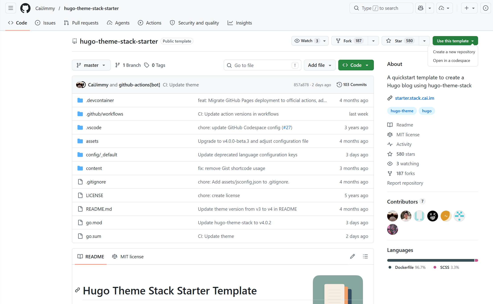
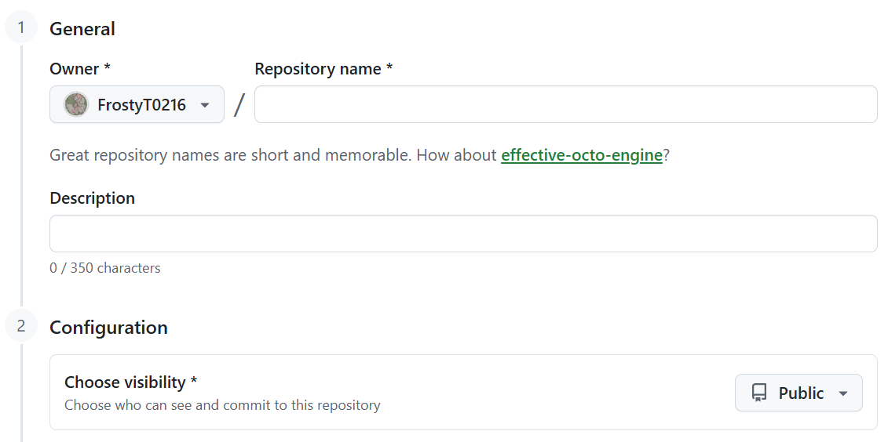
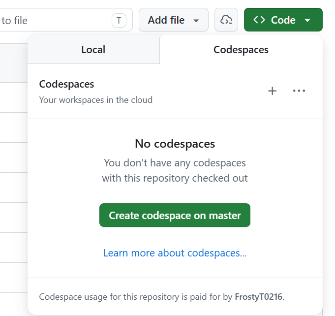
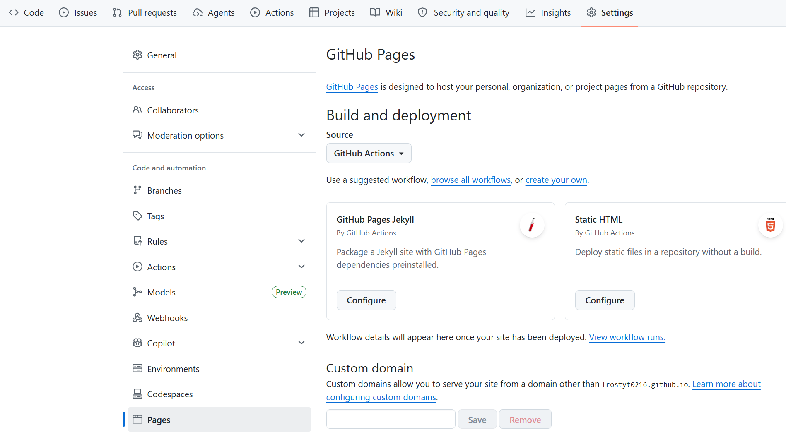
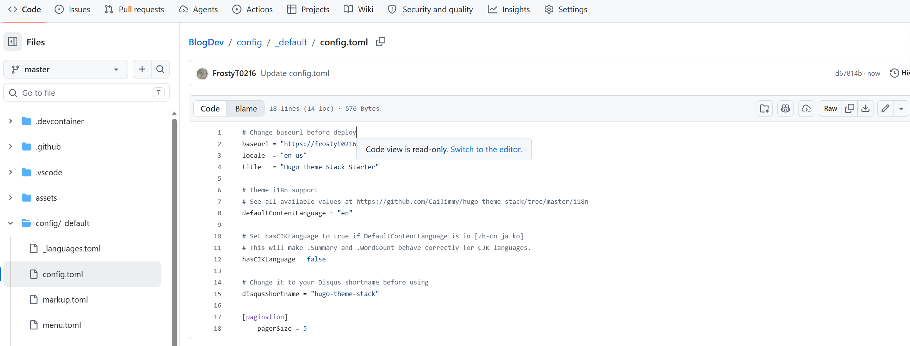
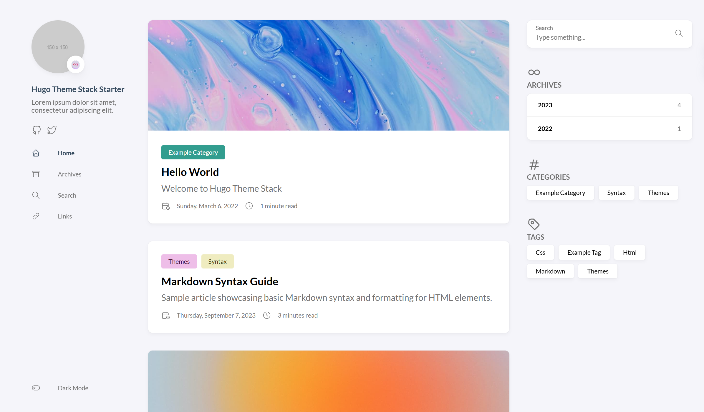

# 使用 Hugo + Stack 主题快速搭建个人博客

> 本文介绍了如果使用Hugo + Stack 主题快速搭建个人博客，再搭配 Github Pages 实现0成本搭建个人博客的全过程。 
> 本文下方使用的是 Stack 主题，如果你使用的主题不一致可能会有部分内容无法对上，请查看所使用的主题的文档。

## 开始前准备

在正式开始教程前，请确保你拥有以下的**条件**：
    - 一台电脑
        - 需要安装了 Visual Studio Code（亦或是其他的IDE，本文使用 Visual Studio Code 作为演示）
        - 需要安装了 Git
        - 需要能够正常上网
    - 一个可用的 Github 账号

## 关于Hugo

Hugo 是一个使用了Go语言编写的静态站点生成器。它的框架灵活，并支持分类和多语言系统，因此我认为 Hugo 非常适合用来搭建一些较为简单的个人博客或是静态展示网页。

---

## 第一步：站在巨人的肩膀上出发

### 克隆 Stack 主题的模板仓库

Stack 官方为我们准备了一个快速上手的 Github 模板仓库。通过使用这个模板，我们能够跳过安装 Hugo 和安装主题文件的繁琐步骤，并且能快速看到效果。 
首先点击进入 Stack 的模板仓库：[hugo-theme-stack-starter](https://github.com/CaiJimmy/hugo-theme-stack-starter) 
点击右上角的绿色 "Use this template" 按钮，选择 "Create a new repository" 新建一个自己的代码仓库。 

在 Repository name 中填入自己的仓库名字。这里推荐使用以下的格式 
`你的 Github 用户名.github.io`  
至于为什么推荐使用这个格式呢？如果你使用这个格式，你的博客网页地址将会是`https://你的 Github 用户名.github.io/`。如果你使用了自己起名的仓库名称，地址将会变成`https://你的 Github 用户名.github.io/你的仓库名字/`。相比与前者，必须要再输入几个字符，有点显得多余了。 
同时在 Choose visibility 中，你**必须选择 Public （公开仓库）的选项**。不选择公开可能导致无法成功部署页面。

### 部署页面前的设置

在正式部署你的博客前，**必须要进行以下的几个设置**： 
首先点击 **Code > Codespaces > Create codespace on master** 创建一个 Github 代码空间。不必担心这样的云服务会产生费用，个人用户有**每个月2000分钟的免费额度**，每次部署大概就花费1~2分钟的额度，除非你是一天更十几次的传奇写文手，不然都是够用的。

创建好后返回你的代码仓库，在上方的导航处点击 **Settings** 选项卡，在 **Pages** 页面中将 ** Build and deployment** 的选项改成 **GitHub Actions**。 

然后在**`**你的仓库名字/config/_default/config.toml**中，将 baseurl 后的值改成你的博客网址。网址在上文中有详细的说明，请根据你的情况填写。注意，你要点击铅笔图标后才能在线编辑这个配置文件。

静静等待几分钟后，访问你的博客网址，你应该就能看到一个示例的页面了。

***余下内容正在编写中***

